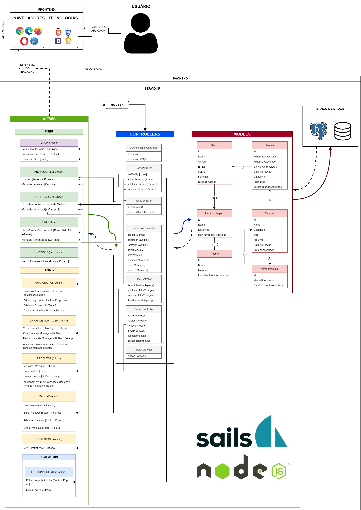

# Arquitetura MVC
&nbsp;&nbsp;&nbsp;&nbsp;A plataforma desenvolvida pelo grupo Dellvelopers é uma aplicação web desenvolvida para funcionar na intranet da Dell Technologies com base na estrutura MVC (Modelo-Visão-Controlador). Dessa maneira, o propósito dessa solução é oferecer aos colaboradores das linhas de produção um acesso simples e eficaz a manuais de montagem de diversos produtos da empresa, como computadores, periféricos e servidores. Esse sistema permite que os colaboradores acessem e se atualizem sobre os processos de montagem de maneira personalizada, ao mesmo tempo em que garante aos administradores a possibilidade de monitorar os processos e atualizar rapidamente as suas equipes.

&nbsp;&nbsp;&nbsp;&nbsp;Assim, visando escalabilidade no projeto, optou-se por usar a arquitetura MVC (Model-View-Controller). Esse modelo é um padrão arquitetural utilizado no desenvolvimento de software para separar a lógica de negócios (Model), a apresentação dos dados (View) e a interação do usuário (Controller). Isso permite uma organização mais clara e modular do código, facilitando a manutenção e o desenvolvimento de aplicações. Tendo isso em vista, a Figura 1 representa essa arquitetura no formato de um diagrama.

    Figura 1 - Diagrama MVC
     
    
     
    Fonte: Material produzido pelos autores (2024)

 
[Diagrama MVC em PDF](assets/mvcDiagram.pdf) 
[Diagrama MVC em PNG](assets/mvcDiagram.png)

## MVC
### Modelos (Models):

&nbsp;&nbsp;&nbsp;&nbsp;O Modelo (Model) representa a camada responsável pela lógica de negócios e manipulação dos dados em uma aplicação. Ele encapsula a estrutura de dados, regras de negócios, operações de acesso ao banco de dados e lógica de processamento. Os modelos são independentes da interface do usuário e interagem com o controlador para receber solicitações, processá-las e retornar os resultados para serem apresentados na visualização. Eles desempenham um papel crucial na separação de preocupações, promovendo a modularidade e a manutenibilidade do código, facilitando também a reutilização e os testes automatizados. Nessa perspectiva, para realizar todas as interações com o banco de dados objetivadas pela plataforma, a proposta da equipe Dellvelopers utiliza dos modelos a seguir: 

1. **USERS:**
    - **Id:** Identificador único do usuário (chave primária).
    - **Nome:** Nome do usuário.
    - **Gênero:** Gênero do usuário.
    - **E-mail:** Endereço de e-mail do usuário
    - **Senha:** Senha do usuário.
    - **Favoritos:** Itens adicionados aos favoritos pelo usuários (Inicialmente vazio).
    - **Nível de Acesso:** Nível de acesso do usuário dentro do sistema.

2. **Tarefas:**
   - **Id:** Identificador único da tarefa (chave primária).
   - **IdMontadorAssociado:** Identificador do usuário associado à tarefa (chave estrangeira que referencia a entidade Users).
   - **IdManualAssociado:** Identificador do manual associado à tarefa (chave estrangeira que referencia a entidade Manuais).
   - **Conclusão:** Booleano que demarca se uma atividade já foi concluída (pendente, terminado).
   - **Data de publicação:** Data em que a tarefa doi publicada pelo administrador.
   - **Data de Limite:** Data limite para que o usuário conclua a tarefa.
   - **Prioridade:** Prioridade da tarefa para ordenação de tarefas.
   - **IdEncarregadoAssociado:** Identificador do usuário com permissão de admin ou high-admin que está encarregado da supervisão da tarefa (chave estrangeira que referencia a entidade Users).    

3. **Manuais:**
   - **Id:** Identificador único do manual (chave primária).
   - **Nome:** Nome do manual.
   - **Descrição:** Descrição do manual.
   - **Tipo:** Tipo de arquivo incluso no manual (.txt, .pdf, vídeos, modelos 3D, imagens, etc).
   - **Arquivos:** Caminho de arquivos suplementares (.txt, .pdf, vídeos, modelos 3D, imagens, etc).
   - **DataPublicação:** Timestamp da data em que o manual foi criado ou atualizado.
   - **ProdutoAssociado:** Identificador do produto ao qual esse manual se associa (chave estrangeira referenciando a entidade Produto).

4. **VersãoManuais:**
   - **Id:** Identificador único da tabela de versionamento do manual (chave primária).
   - **ManualAssociado:** Identificador da versão do manual associado (chave estrangeira referenciando a entidade Manuais).
   - **DataPublicaçãoAssociada:** Timestamp da data em que o manual foi criado/ atualizado (chave estrangeira referenciando a entidade Manuais).

5. **LinhaMontagem:**
   - **Id:** Identificador único da linha de montagem (chave primária).
   - **Nome:** Nome da linha de montagem.
   - **Descrição:** Descrição da linha de montagem.
   - **IdEncarregadoAssociado:** Identificador do usuário com permissão de admin ou high-admin que está encarregado da supervisão da tarefa (chave estrangeira que referencia a entidade Users).

6. **Produto:**
   - **Id:** Identificador único do produto (chave primária).
   - **Nome:** Nome do produto.
   - **Metadado:** Metadados identificadores associados ao produto.
   - **LinhaMontagemAssociado:** Identificador da linha de montagem associada ao produto (chave estrangeira que referencia a entidade LinhaMontagem).  

#### Relacionamentos e Cardinalidades:
Em bancos de dados, relacionamentos e cardinalidades referem-se à maneira como as tabelas se conectam entre si. Um relacionamento descreve a associação entre duas tabelas por meio de chaves estrangeiras, estabelecendo vínculos entre os dados. As cardinalidades definem a quantidade de registros que podem estar associados em cada extremidade do relacionamento, indicando se é um-para-um (1,1), um-para-muitos (1,n) ou muitos-para-muitos (n,n). Baseado nisso, os modelos descritos anteriormente apresentam os seguintes relacionamentos e ordens de cardinalidade:

- Um usuário pode ter muitas tarefas associadas a ele (relação 1 para n entre Users e Tarefas).
- Uma tarefa pode ter apenas um manual associado a ela (relação 1 para 1 entre Tarefas e Manuais).
- Um histórico de manuais pode ter muitas versões de um mesmo manual associado a ele(relação 1 para n entre VersãoManuais e Manuais).
- Vários Produtos podem ter um Manual e um Produto pode ter diversos manuais associado a ele (relação n para n entre Produto e Manuais).
- Uma linha de montagem pode ter diversos produtos associados a ela (relação 1 para n entre LinhaMontagem e Produto).
- Uma linha de montagem pode ter vários usuários associados a ela (relação n para 1 entre Users e LinhaMontagem).

### Controladores (Controllers):

O Controlador (Controller) é a camada responsável por receber as solicitações do usuário, interpretá-las e coordenar as ações necessárias. Ele atua como intermediário entre as visualizações (Views) e os modelos (Models), direcionando o fluxo de dados e controlando a lógica de apresentação. Os controllers manipulam eventos do usuário, como cliques de botão ou envio de formulários, e decidem quais ações devem ser tomadas com base nessas interações. Eles são responsáveis por invocar métodos nos modelos, processar os dados resultantes e, em seguida, atualizar as visualizações correspondentes para refletir as alterações. Os controllers desempenham um papel fundamental na coordenação das operações da aplicação, garantindo uma interação eficiente entre os modelos e as visualizações. Em vista disso, a proposta da equipe Dellvelopers toma como centrais os seguintes controladores:

#### AuthenticationController (Controlador de Autenticação)
- **autenticar(email: string, senha: string)**: Verificar existência do usuário no banco de dados e validade das credenciais.
  - Entrada: `email`, `senha`.
  - Saída: `Sucesso`, Dados do usuário || `Erro`.

- **autenticarSSO(id: int)**: Verificar as credenciais obtidas pelo SSO.
  - Entrada: `id`.
  - Saída: `Sucesso`, Dados do usuário || `Erro`.
  
  O AuthenticationController interage com o modelo Users e verifica a validade das credenciais para permitir acesso no sistema baseado no `Nível de Acesso` do usuário, caso as credenciais sejam validas.  

#### UserController (Controlador de Usuário)
- **verPerfil(idUsuario: int)**: Exibe o perfil do usuário.
  - Entrada: `idUsuario`.
  - Saída: Detalhes do perfil do usuário.
- **editarUsuario(idUsuario: int, nivelAcesso: int, novosDados: object)**: Caso o usuário tenha o nível de acesso necessário, permite a edição de perfis de usuários com nível de acesso menor ou igual ao do editor. 
  - Entrada: `idUsuarioAlvo`, `nivelAcesso`, `novosDados` (JSON com campos editados).
  - Saída: `Sucesso`, Perfil atualizado || `Erro`.
- **adicionarUsuario(idUsuario: int, nivelAcesso: int, novosDados: object)**: Caso o usuário tenha o nível de acesso necessário, permite a adição de perfis de usuários com nível de acesso menor ou igual ao do editor. 
  - Entrada: `idUsuarioAlvo`, `nivelAcesso`, `novosDados` (JSON com `nome`, `genero`, `e-mail`, `senha`, `nivelAcesso`).
  - Saída: `Sucesso`, Usuário Adicionado || `Erro`.
- **removerUsuario(idUsuario: int, nivelAcesso: int)**: Caso o usuário tenha o nível de acesso necessário, permite a remoção de perfis de usuários com nível de acesso menor ou igual ao do editor. 
  - Entrada: `idUsuarioAlvo`, `nivelAcesso`.
  - Saída: Tela de COnfirmação && (`Sucesso`, Usuário Removido (Irreversível) || `Erro`).

  Baseado no `Nível de Acesso` do usuário, o UserController realiza operações relacionadas à os usuários dentro do banco de dados. Esse controlador permite a visualização, edição, adição e remoção de usuários, de maneira que se comunica exclusivamente com o modelo Users.

#### TaskController (Controlador de Tarefa)
- **listarTarefas(idUsuario: int)**: Lista todas as tarefas associadas ao usuário.
  - Entrada: `idUsuario`.
  - Saída: `Sucesso`, Lista de tarefas || `Erro`.
- **atualizarStatusDaTarefa(idUsuario: int, idTarefa: int)**: Marca uma tarefa como terminada.
  - Entrada: `idTarefa`, `idUsuario`.
  - Saída: `Sucesso`, `Conclusão == true` || `Erro`.

  O TaskController interage com o modelo Tarefas e gere todas as tarefas atribuídas à um usuário e permite a atualização de status da tarefa mediante a conclusão de requisitos

#### HandbookController (Controlador de Manuais)
- **acessarManuais()**: Exibe o manual.
  - Entrada: `idManual`.
  - Saída: `Sucesso`, Conteúdo do Manual || `Erro`.
- **adicionarFavorito(idUsuarioAlvo:int, idManual: int)**: Adiciona manuais à lista de favoritos do usuário. 
  - Entrada: `idUsuarioAlvo`, `idManual`.
  - Saída: `Sucesso`, Manual Adicionado à lista de favoritos || `Erro`.
- **removerFavorito(idUsuarioAlvo:int, idManual: int)**: Remove manuais da lista de favoritos do usuário. 
  - Entrada: `idUsuarioAlvo`, `idManual`.
  - Saída: `Sucesso`, Manual da lista de favoritos || `Erro`.
- **listarManuais**: Lista todos manuais.
  - Entrada: Nenhuma.
  - Saída: Lista de tarefas.
- **editarManuais(idManual: int, nivelAcesso: int, novosDados: object)**: Caso o usuário tenha o nível de acesso necessário, permite a edição manuais. 
  - Entrada: `idUsuarioAlvo`, `nivelAcesso`, `novosDados` (JSON com campos editados).
  - Saída: `Sucesso`, Manual atualizado || `Erro`.
- **adicionarManuais(idManual: int, nivelAcesso: int, novosDados: object)**: Caso o usuário tenha o nível de acesso necessário, permite a adição manuais. 
  - Entrada: `idUsuarioAlvo`, `nivelAcesso`, `novosDados` (JSON com `nome`, `descrição`, `tipo`, `arquivos`, `produtoAssociado`).
  - Saída: `Sucesso`, Manual Adicionado || `Erro`.
- **removerManuais(idManual: int, nivelAcesso: int)**: Caso o usuário tenha o nível de acesso necessário, permite a remoção manuais. 
  - Entrada: `idUsuarioAlvo`, `nivelAcesso`.
  - Saída: Tela de Confirmação && (`Sucesso`, Manual Removido (Irreversível) || `Erro`).
- **filtrarManuais(filtros: object)**: Aplica filtros específicos à lista de manuais.
  - Entrada: `filtros`
  - Saída: Listagem de manuais filtrados.

  O HandbookController opera todas as funções relacionadas aos manuais, tal como adicionar, remover, editar, listar e filtrar manuais. Ademais, esse controller também é responsável por fazer o controle das adições e remoçoes dos Manuais a lista de favoritos. Desse modo, ele interage com o modelo de Manuais para acessar e alterar dados, além de interagir com o modelo de Users para alterar os conteúdos do objeto `favoritos` no modelo User.  

#### LineController (Controlador da Linha de Montagem) - Admin
- **listarLinhasMontagem()**: Lista de todas as linhas de montagem.
  - Entrada: Nenhuma.
  - Saída: Lista de todas as linhas de montagem.
- **adicionarLinhaMontagem(novosDados: object)**: Adiciona uma nova Linha de Montagem.
  - Entrada: `idLinhaMontagem`, `novosDados` (JSON com `nome`, `descrição`, `idEncarregado`).
  - Saída: `Sucesso`, Linha de Montagem Adicionada || `Erro`.
- **removerLinhaMontagem(idLinhaMontagem: int)**: Remove uma linha de montagem.
  - Entrada: `idLinhaMontagem`.
  - Saída: Tela de Confirmação && (`Sucesso`, Linha de montagem removida (Irreversível) || `Erro`)
- **filtrarLinhasMontagem(filtros: object)**: Remove uma linha de montagem.
  - Entrada: `filtros`.
  - Saída: Listagem de linhas de montagem filtradas.

  O LineController administra as linhas de montagem e permite a listagem, visualização, edição e remoção das linhas existentes. Esse controlador interage com o modelo LinhaMontagem para acessar e manipular informações sobre as linhas de montagem.

#### ProductController (Controlador dos Produtos) - Admin
- **listarProduto()**: Lista de todos os produtos.
  - Entrada: Nenhuma.
  - Saída: Lista de todos os produtos.
- **adicionarProduto(novosDados: object)**: Adiciona um novo Produto.
  - Entrada: `idProduto`, `novosDados` (JSON com `nome`, `metadado`, `idLinhaDeMontagemAssociada`).
  - Saída: `Sucesso`, Produto Adicionado || `Erro`.
- **removerProduto(idProduto: int)**: Remove um Produto.
  - Entrada: `idProduto`.
  - Saída: Tela de Confirmação && (`Sucesso`, Produto removido (Irreversível) || `Erro`)
- **filtrarProduto(filtros: object)**: filtra linhas de montagem.
  - Entrada: `filtros`.
  - Saída: `Sucesso`, Listagem de linhas de montagem filtradas || `Erro`.
- **associarManuais(idProduto: int, idManual: int)**: associa um manual ao produto.
  - Entrada: `idProduto`, `idManual`.
  - Saída: `Sucesso`, Manual Associado || `Erro`.
- **desassociarManuais(idProduto: int, idManual: int)**: desassocia um manual do produto.
  - Entrada: `idProduto`, `idManual`.
  - Saída: `Sucesso`, Manual Desassociado || `Erro`.

  O ProductController administra os produtos de uma linha de montagem e permite a listagem, visualização, edição e remoção dos produtos existentes, além de permitir associar e desassociar manuais. Esse controlador age com o modelo Produto para acessar e manipular informações sobre os Produtos.

#### StatsController (Controlador de Estatísticas)
- **plottarGraficos(dados: object)**: Permite a criação de gráficos e e vizualização de estatísticas.
  - Entrada: `dados`.
  - Saída: `Sucesso`, Gráficos de estatísticas || `Erro`.

  O StatsController gere todos os gráficos e estatíticas da plataforma baseado em models como Users, Tarefas, Manuais, LinhaMontagem e Produto.

### Vizualizações (Views):
#### Todos os usuários
- Tela de login:
   - Inputs: email, senha, botão de "esqueci minha senha", login com SSO. 
   - Funcionalidade: Permite que o usuário faça login na plataforma.
#### Montadores
- Meu Progresso:
   - Seções: Kanban (Tabela com tarefas (Botões)) e Manuais recentes (Carrossel) .
   - Funcionalidade: Permite que o usuário organize as suas tarefas e veja manuais recentes.
- Explorar Mais:
   - Seções: Vizualizar todos os manuais (Galeria) e Manuais de cada uma das linhas de montagem (vários Carroséis).
   - Funcionalidade: Permite explorar diferentes manuais e auxilia o usuário a conhecer partes diferentes das linhas de montagem.
- Perfil:
   - Seções: Vizualizar informações do perfil (Formulário não editável) e Manuais adicionados a lista de favoritos (Carrosel).
   - Funcionalidade: Permite ver o perfil do usuário onde todas as informações importantes de indentificação do usuário podem ser encontradas, além de que a lista de favoritos pode ser acessada para facilitar o acesso de manuais importantes para o usuário.
- Notificação:
    - Seção: Ver notificações (Cria um dropdown que permite interação).
    - Funcionalidade: Permite que os usuários sejam notificados de alterações na plataforma ou nos manuais.
#### Admins
- Funcionários: 
    - Seção: Controle dos funcionários por meio de uma tabela com os usuários da plataforma.
    - Funcionalidades: Permite adicionar/excluir/editar funcionários, seus cargos e atividades designadas.
- Linhas de Montagem:
    - Seção: Controle das linhas de montagem por meio de uma tabela com as linhas de montagem da plataforma.
    - Funcionalidade: Permite adicionar/excluir/editar linhas de montagem e os funcionários atribuídos a elas.
- Produtos:
    - Seção: Controle dos produtos por meio de uma tabela com todos os produtos.
    - Funcionalidade: Permite adicionar/excluir/editar produtos e os funcionários atribuídos a eles.
- Manuais:
    - Seção: Controle total de todos os manuais da plataforma por meio de uma galeria.
    - Funcionalidade: Permite adicionar/excluir/editar/vizualizar manuais e os materiais associados à eles.
- Estatísticas: 
    - Seções: Gráficos diversos com uma pluralidade de informações sobre o sistema.
    - Funcionalidades: Permite ver os gráficos sobre o sistema.

#### High-Admins
- Funcionários: 
    - Seção: Controle total dos funcionários (montadores e admins) por meio de uma tabela com os usuários da plataforma.
    - Funcionalidades: Permite adicionar/excluir/editar funcionários, seus cargos e atividades designadas.

### Infraestrutura e o MVC:

A infraestrutura de uma aplicação web engloba diversos componentes essenciais para seu funcionamento eficiente. Cada parte desempenha um papel crucial na operação e no desempenho geral da aplicação. Nesse sentido, algumas das tecnologias previstas para o desenvolvimento da plataforma são:

- **Banco de Dados PostgreSQL**: O banco de dados PostgreSQL desempenha um papel fundamental no armazenamento de informações críticas da aplicação, como dados de cursos, usuários, estatísticas e outros. No contexto do MVC, o PostgreSQL é a base de dados que representa o Modelo da aplicação, onde entidades são representadas e manipuladas pelos controladores para realizar operações de CRUD.

- **Serviço de Notificações**: Integrar um serviço de notificações por e-mail e push, como Amazon SES ou Firebase Cloud Messaging, permite enviar informações importantes aos usuários sobre atualizações nos cursos e outras atividades relevantes. No MVC, esse serviço complementa o controle de fluxo, permitindo que os controladores enviem notificações conforme necessário para os usuários, principalmente quando um manual é atualizado.

- **API de Single Sign-On (SSO)**: Integrar um sistema de Single Sign-On (SSO) da Dell através de uma API permite aos usuários autenticarem-se na aplicação utilizando as credenciais de suas contas corporativas. Essa integração facilita o acesso dos usuários à aplicação, simplificando o processo de login. No MVC, essa API representa uma parte crucial do controle de acesso, intermediando a autenticação dos usuários antes de encaminhá-los para as ações apropriadas dos controladores.

- **Serviço de Armazenamento de Arquivos**: Um serviço de armazenamento de arquivos interno da Dell, pode ser utilizado para guardar documentos, imagens, vídeos e outros recursos associados aos cursos da aplicação. No contexto do MVC, esse serviço complementa o Modelo, permitindo armazenar e recuperar arquivos conforme necessário pelos controladores para apresentação aos usuários.

- **Microsserviços e Containers**: A arquitetura baseada em microsserviços e containers oferece escalabilidade e flexibilidade para a aplicação. Utilizando tecnologias como Docker e Kubernetes, os microsserviços são distribuídos em vários servidores, permitindo uma melhor gestão e escalabilidade dos serviços. No MVC, cada microsserviço pode ser considerado uma parte do Modelo ou Controlador, dependendo de sua função na aplicação.

- **Sistema de Cache**: Implementar um sistema de cache é crucial para melhorar o desempenho da aplicação, armazenando conteúdos mais acessados e reduzindo a carga nos servidores. No MVC, o sistema de cache pode ser considerado uma extensão do Modelo, auxiliando os controladores na recuperação eficiente de dados para apresentação nas Views.

- **HTML**: HTML é a linguagem de marcação usada para estruturar e organizar o conteúdo de uma página web. No contexto do MVC, as estruturas HTML representam as Views, responsáveis por apresentar os dados aos usuários de forma adequada.

- **CSS**: CSS (Cascading Style Sheets) é uma linguagem de estilo utilizada para definir a apresentação e o layout dos elementos HTML em uma página web. No MVC, o CSS é aplicado nas Views para estilizar e formatar os elementos HTML, garantindo uma apresentação visualmente atraente e consistente.

- **JavaScript**: JavaScript é uma linguagem de programação utilizada para adicionar interatividade e dinamismo às páginas web. No contexto do MVC, o JavaScript pode ser usado nas Views para manipular elementos da página e realizar operações assíncronas, interagindo com os Controladores conforme necessário.

- **Node.js**: Node.js é um ambiente de execução JavaScript que permite executar código JavaScript no servidor. No MVC, Node.js é frequentemente usado para implementar os Controladores, que recebem as requisições dos clientes, manipulam os dados no Modelo e determinam qual Visão deve ser apresentada como resposta.

- **Sails.js**: Sails.js é um framework Node.js que facilita o desenvolvimento de aplicativos da web e APIs RESTful. No contexto do MVC, Sails.js é utilizado para implementar os Controladores e rotear as requisições HTTP para as ações adequadas, como autenticação de usuários, manipulação de cursos, etc.

- **Bootstrap**: Bootstrap é um framework front-end que fornece componentes e estilos pré-construídos para facilitar o desenvolvimento de interfaces web responsivas. No MVC, o Bootstrap pode ser usado nas Views para criar layouts responsivos e consistentes, facilitando o desenvolvimento e a manutenção da interface do usuário.

- **Browsers**: Também conhecidos como navegadores, estes são programas responsáveis pelo acesso à internet. São eles que interpretam as páginas feitas por meio do HTML e as deixam visíveis de forma ilustrativa ao usuário, transformando linhas de código em imagens, letras e outros elementos visuais. Desta forma, cria uma ambiente atrativo aos olhos do cliente que estará utilizando a aplicação web. A título de representatividade, foram colocados os ícones do Google Chrome e do Mozilla Firefox.

### Escolha de arquitetura

- **Backend: Node.js com Sails.js**
    - A escolha do Node.js como plataforma de backend oferece diversas vantagens. Sendo baseado em JavaScript, Node.js proporciona uma transição suave entre o frontend e o backend, permitindo que os desenvolvedores utilizem a mesma linguagem em ambas as partes da aplicação, o que facilita a colaboração e o entendimento do código. Além disso, a natureza assíncrona do Node.js é ideal para operações de entrada/saída intensivas, como requisições HTTP e acesso a bancos de dados, garantindo um desempenho escalável. Já o Sails.js, como um framework MVC para Node.js, oferece uma estrutura organizada e predefinida para o desenvolvimento de aplicativos web e APIs RESTful, acelerando o processo de desenvolvimento e promovendo a modularidade do código. Sua abordagem orientada a convenções simplifica a configuração e o roteamento das rotas HTTP, tornando-o uma escolha sólida para a construção de aplicações web robustas e escaláveis.

- **Banco de Dados: PostgreSQL**
    - O PostgreSQL é uma escolha confiável para o armazenamento de dados em uma aplicação, oferecendo uma ampla gama de recursos avançados, como suporte a chaves estrangeiras, integridade referencial, transações ACID e capacidade de expansão para lidar com grandes volumes de dados. Sua robustez e confiabilidade são fundamentais para garantir a integridade e consistência dos dados em ambientes de produção. Além disso, o PostgreSQL é conhecido por sua compatibilidade com os padrões SQL, facilitando a migração de sistemas legados e a interoperabilidade com outras ferramentas e tecnologias. Com uma comunidade ativa e uma vasta gama de extensões disponíveis, o PostgreSQL oferece flexibilidade e escalabilidade para atender às necessidades de uma aplicação web em crescimento.

- **Frontend: HTML, CSS, JS e Bootstrap**
    - A combinação de HTML, CSS, JavaScript e Bootstrap é uma escolha poderosa para o desenvolvimento do frontend de uma aplicação web. HTML fornece a estrutura básica para organizar o conteúdo da página, enquanto CSS permite estilizar e formatar os elementos HTML de acordo com as diretrizes de design da aplicação. JavaScript adiciona interatividade e dinamismo à página, permitindo manipular elementos e responder a eventos do usuário. Por fim, o Bootstrap oferece um conjunto de componentes e estilos pré-construídos que facilitam o desenvolvimento de interfaces web responsivas e visualmente atraentes. Sua grade responsiva e biblioteca de componentes economizam tempo de desenvolvimento e garantem uma experiência consistente em diferentes dispositivos e navegadores. Essa combinação de tecnologias proporciona uma base sólida para criar interfaces de usuário modernas e intuitivas, garantindo uma experiência agradável para os usuários finais.

